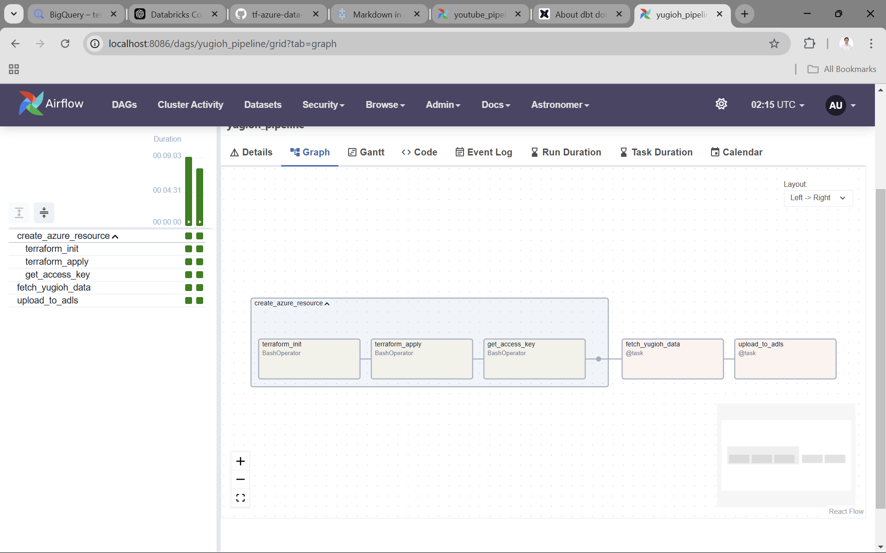

# Yugioh Data Pipeline with Airflow

This repository contains the yugioh_pipeline dag and supporting configurations to fetch Yugioh card data, transform it, and visualize insights using Azure and Power BI.

## Architecture

## Airflow Dags

## Power BI Dashboard

## LakeDB Schema

